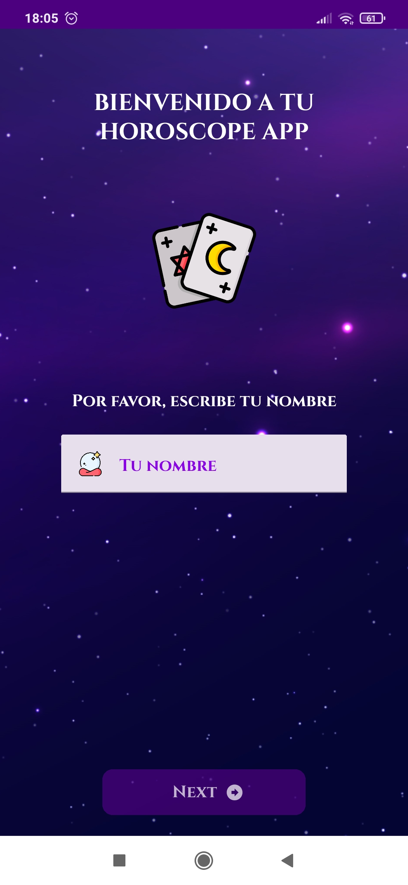
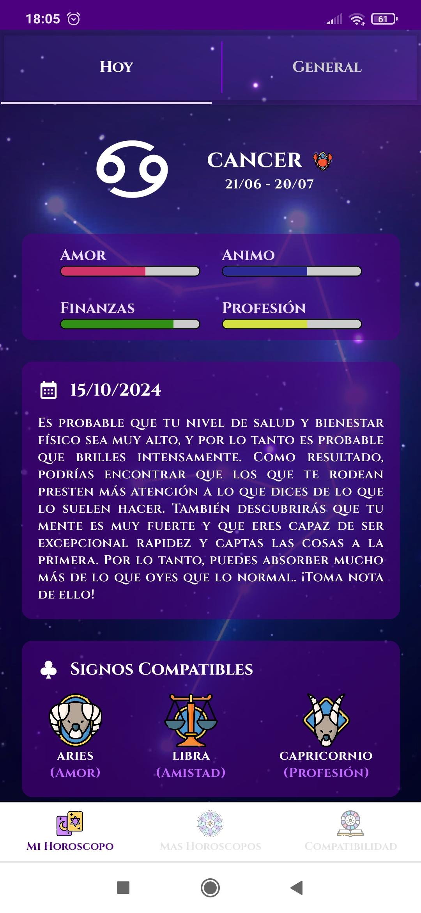
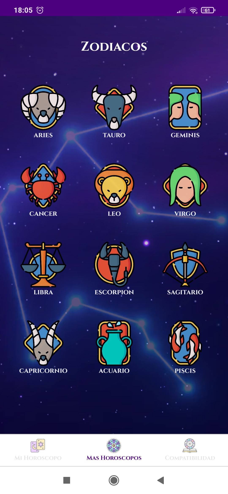
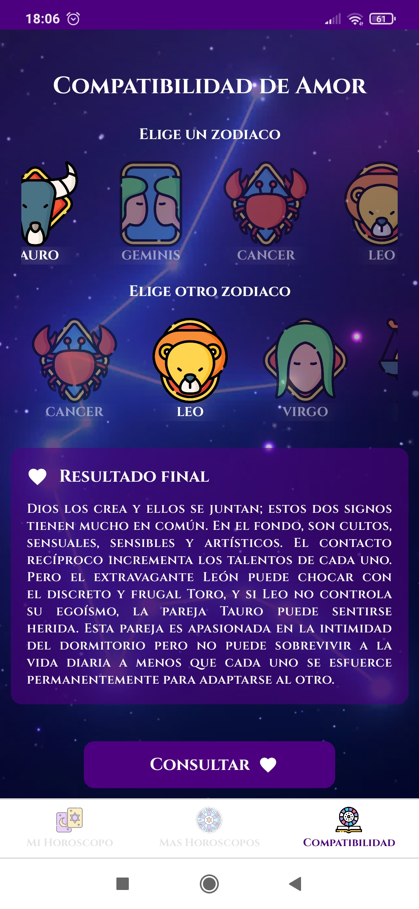

Horoscope App
## Info

App realizada en React Native sobre el horóscopo. Se puede consultar el horóscopo diario y también tiene una sección para consultar
la compatibilidad entre diferentes signos.

La información se actualiza a diario mediante un script en python que inserta el horoscopo del día en firebase.

Para la store se ha optado por usar Zustand.

Las imagenes han sido sacadas de freepik.

## Screenshots

<table>
  <tr>
<td></td>
<td></td>
  </tr>
  <tr>
<td></td>
<td></td>
  </tr>
</table>
